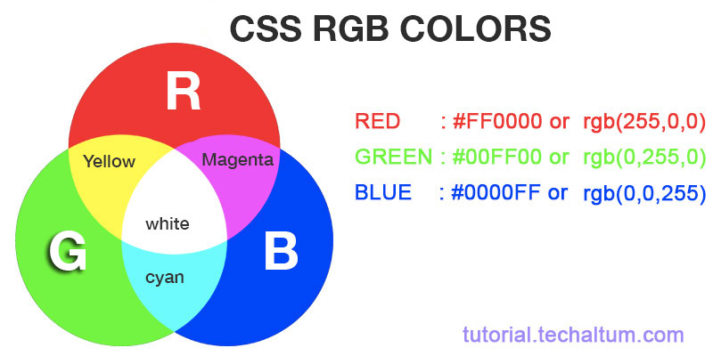
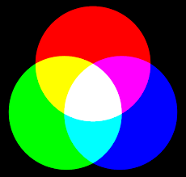
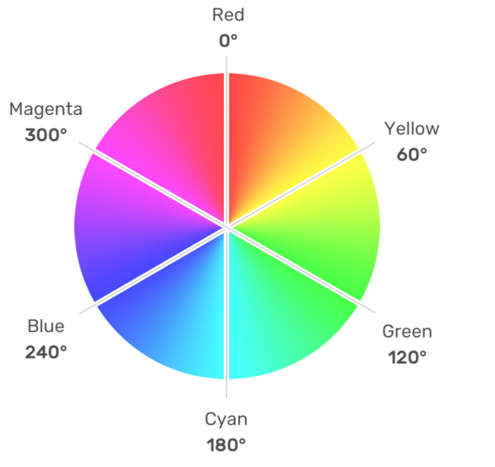
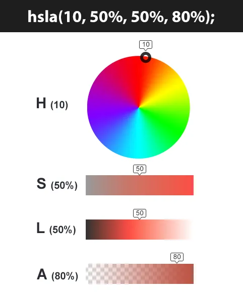

# Colores

- Dato: Hay 140 colores disponibles como `red`, `blue`, `green`, `black`, U.u

## Hexadecimal



```css
element {
	color: #ff0000;
	background-color: #00ff00;
}
```

## RGB (Red, Green, Blue)



```css
element {
	color: rgb(255, 0, 0);
	background-color: rgb(0, 255, 0);
}
```

## RGBA (Red, Green, Blue, Alpha)

```css
element {
	color: rgba(255, 0, 0, 0.5);
	background-color: rgba(0, 255, 0, 0.3);
}
```

## HSL (tono, saturación, luminosidad)




```css
element {
	color: hsl(0, 100%, 50%);
	background-color: hsl(120, 100%, 50%);
}
```

## HSLA (tono, saturación, luminosidad, Alpha)

```css
element {
	color: hsla(0, 100%, 50%, 0.5);
	background-color: hsla(120, 100%, 50%, 0.3);
}
```

## Current Color

- Color heredado2

```css
element {
	color: red;
	border: 5px solid currentColor;
}
```

#### Colores Lab y LCH
