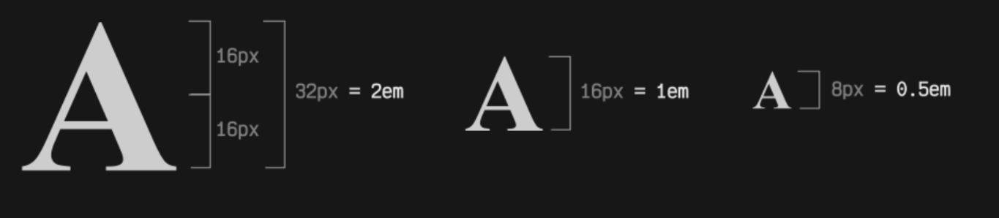
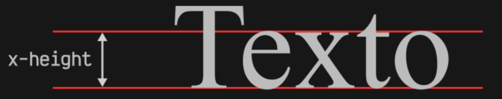

# Medidas

## Unidades Absolutas

- Tienen un tamaño fijo
- No cambian en función del contexto (como el tamaño de la pantalla)

| Unidad | Descripción                      | Ejemplo            |
| ------ | -------------------------------- | ------------------ |
| px     | Píxeles                          | `width: 12px;`     |
| cm     | Centímetros, para impresiones.   | `width: 5cm;`      |
| mm     | Milímetros                       | `width: 10mm;`     |
| in     | Pulgadas. 1 pulgada = 2.54 cm.   | `width: 1in;`      |
| pt     | Puntos. 1 punto = 1/72 pulgadas. | `font-size: 12pt;` |
| pc     | Picas. 1 pica = 12 puntos.       | `width: 2pc;`      |

## Unidades Relativas

- Son las dependientes
  - tamaño de fuente del elemento padre
  - tamaño de la ventana del navegador.

| Unidad | Descripción                                          | Ejemplo            |
| ------ | ---------------------------------------------------- | ------------------ |
| em     | Multiplicador de la fuente actual.                   | `font-size: 2em;`  |
| rem    | Multiplicador de la fuente raíz (definida en :root). | `padding: 1.5rem;` |
| %      | Relativo al elemento padre.                          | `width: 50%;`      |
| vw     | Ancho de la ventana.                                 | `width: 100vw;`    |
| vh     | Altura de la ventana.                                | `height: 100vh;`   |
| vmin   | El menor entre vw y vh.                              | `width: 50vmin;`   |
| vmax   | El mayor entre vw y vh.                              | `width: 50vmax;`   |
| dvw    | Viewport dinámico para el ancho.                     | `width: 50dvw;`    |
| dvh    | Viewport dinámico para la altura.                    | `height: 50dvh;`   |

## Otras

| Tipo de unidad          | Unidades                         | Descripción                                              |
| ----------------------- | -------------------------------- | -------------------------------------------------------- |
| Relativas al viewport   | vw, vh, vmin, vmax, vi, vb       | Unidades basadas en la región visible del navegador.     |
|                         | svw, svh, svmin, svmax, svi, svb | Idem, en pantallas pequeñas (small viewport)             |
|                         | lvw, lvh, lvmin, lvmax, lvi, lvb | Idem, en pantallas grandes (large viewport).             |
|                         | dvw, dvh, dvmin, dvmax, dvi, dvb | Idem, en pantallas dinámicas (dynamic viewport).         |
| Relativas al contenedor | cqw, cqh, cqmin, cqmax, cqi, cqb | Unidades basadas en un contenedor padre específico.      |
| Relativas al grid       | fr                               | Unidad basada en la fracción restante (sólo para grids). |
| Unidades de dirección   | deg, grad, rad, turn             | Unidades para indicar una dirección.                     |
| Unidades de duración    | s, ms                            | Unidades para indicar un tiempo concreto.                |
| Unidades de frecuencia  | hz, khz                          | Unidades para indicar una frecuencia.                    |

## Mas detalle

| Grados     | Gradianes   | Radianes      | Giro      |
| ---------- | ----------- | ------------- | --------- |
| 0 ó 360deg | 0 ó 400grad | 0 ó 6rad      | 0 ó 1turn |
| 45deg      | 50grad      | 0.78rad (π/4) | 0.125turn |
| 90deg      | 100grad     | 1.57rad (π/2) | 0.250turn |
| 145deg     | 150grad     | 2.35rad       | 0.375turn |
| 180deg     | 200grad     | 3.14rad (π)   | 0.5turn   |
| 215deg     | 250grad     | 3.92rad       | 0.625turn |
| 270deg     | 300grad     | 4.71rad (2π)  | 0.75turn  |
| 325deg     | 350grad     | 5.49rad       | 0.875turn |

# Medidas Relativas

## %

Depende del tamaño del elemento padre inmediato

```css
.parent {
	width: 200px;
	height: 200px;
	background: grey;
}

.child {
	width: 50%;
	height: 100px;
	background: indigo;
}
```

## EM

Tiene un tamaño en base al tamaño que tiene establecido el navegador en la tipografía

- Por defecto, se puede asumir que 1em es un valor aproximado a 16px.
  

```css
.h1 {
	background: blue;
	font-size: 32px;
	width: 2em;
	height: 2em;
	color: white;
}
```

## REM

Esta unidad toma la idea de la unidad em, pero en lugar de tomar el tamaño font-size del elemento actual, toma el tamaño del elemento raíz, es decir, el elemento <html> o la pseudoclase :root

```css
:root {
	font-size: 22px; /* Tamaño base */
}

h1 {
	font-size: 2rem; /* El doble: 2 x 22px = 44px */
}

h2 {
	font-size: 1rem; /* El mismo: 1 x 22px = 22px */
}
```

## EX

hace referencia al tamaño de alto de la primera letra minúscula de la tipografía.

- Podemos asumir que 1ex es aproximadamente 0.5em
  

```css
.element {
	font-family: 'Victor Mono', monospace;
	font-size: 2rem;
	background: #111;
	color: #eee;
	width: 8ch;
}
```

## CH

Hace referencia al tamaño de ancho de un carácter alfanumérico europeo. Suele asumir un tamaño de ancho de 0.5em.

```css
.element {
	font-family: 'Victor Mono', monospace;
	font-size: 2rem;
	background: #111;
	color: #eee;
	width: 8ch;
}
```

## CAP

Permite indicar tamaños basados en el tamaño de alto de la primera letra mayúscula de la tipografía.

```css
.element {
	font-family: 'Victor Mono', monospace;
	font-size: 2cap;
	background: #111;
	color: #eee;
	width: 8ch;
}
```

## LH

Permite indicar tamaños basados en el interlineado de la tipografía (line-height)

```css
.element {
	background: indigo;
	color: #eee;
	font-family: 'Victor Mono', monospaced;
	font-size: 2rem;
	height: 2lh;
	line-height: 120%;
}
```

# Medidas del viewport

## VMAX

Toma el valor máximo de la pantalla (Horizontal o vertical)

```css
.container {
	width: 50vmax;
	height: 50vmax;
	background: indigo;
}
```

## VMIM

Toma el valor mínimo de la pantalla (Horizontal o vertical)

```css
.container {
	width: 50vmin;
	height: 50vmin;
	background: indigo;
}
```
